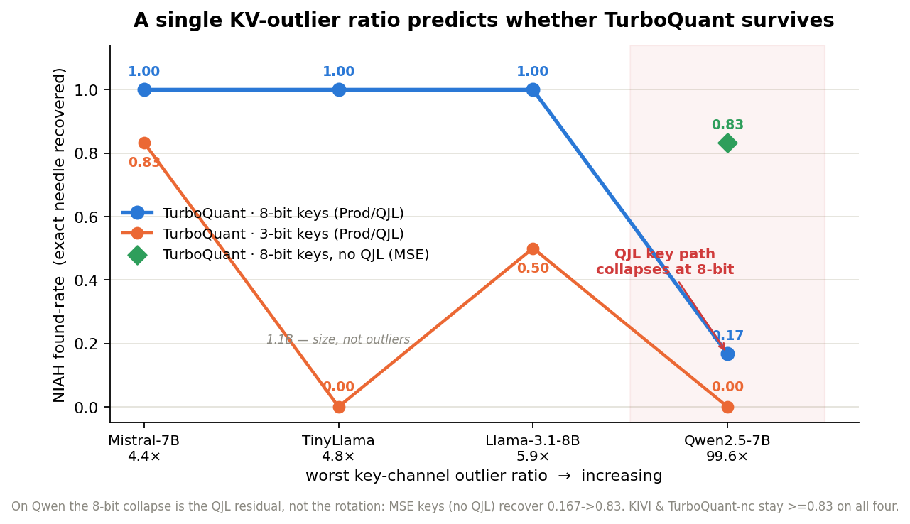

# T1 — TurboQuant KV-Cache Characterization

**Status:** first result (2026-07, Leonardo/CINECA). NIAH quality, counted memory, and mechanism
analysis are landed. LongBench/perplexity and measured serving memory remain future work (§7).

## 1. Headline

**TurboQuant's KV-cache quality is governed by the model's outlier structure — and the KV outlier ratio
predicts whether it survives.** On models with well-behaved KV (**TinyLlama**, **Mistral-7B**,
**Llama-3.1-8B**; worst key channel only ~4–6× the median) uniform TurboQuant is quality-neutral at 8-bit
keys, and its 3-bit degradation scales smoothly with the outlier ratio (Mistral 4.4×→0.83,
Llama 5.9×→0.50) — the textbook picture. But on **Qwen2.5-7B**, which has extreme **boundary-layer outlier
channels** (up to ~100× the median), uniform TurboQuant **collapses at every bit-width** — even 8-bit
K+V scores only 0.167 on needle-in-a-haystack, while 3-bit KIVI scores 1.0. TurboQuant's random rotation
spreads each ~100× outlier across all coordinates, and reconstructing a token dominated by such a channel
accumulates enough error to flip the exact answer (`7421900` → `741900`). On Qwen the only fixes are
`-nc` (leave the first/last layers FP16) or per-channel KIVI.

> **Mild outliers (Mistral 4×, TinyLlama 5×) → uniform TurboQuant works. Extreme outliers (Qwen 100×)
> → it collapses at any bit-width, and 3-bit KIVI beats 8-bit TurboQuant.**

This is a negative result for *uniform* TurboQuant on outlier-heavy KV, consistent with the independent
vLLM evaluation ("FP8 is often the better default") and turboquant_plus ("K precision dominates; protect
the first 2 + last 2 layers").



*Figure 1 — 8-bit-key survival is binary (only Qwen's ~100× outliers break it, dropping to 0.17);
3-bit degrades with the ratio. KIVI / TurboQuant-`nc` stay ≥0.83 on all four (not plotted). TinyLlama's
3-bit = 0 is a 1.1B size effect. Regenerate: `python reports/figures/outlier_gradient.py`.*

## 2. Setup

| | |
|---|---|
| **Models** | Qwen2.5-7B-Instruct (primary); TinyLlama-1.1B-Chat (contrast) |
| **Research layer** | scos-lab/turboquant, vendored @`34a10b6`, audit-passed (49/49; `docs/VALIDATION.md`). Pure NumPy. |
| **Control harness** | `tqsec/quantizers.py`: TurboQuant (paper / mixed / `-nc`), plain INT (per-token), KIVI (per-channel K, per-token V), FP8 (`e4m3`) |
| **Benchmark** | needle-in-a-haystack (`tqsec/benchmarks.py`): hide `The special magic Cairo number is 7421900.` at depth *d* in a filler haystack of ~*L* tokens; **found-rate** = fraction where the generated answer contains `7421900` |
| **Grid** | lengths *L* ∈ {1024, 2048}, depths *d* ∈ {0.25, 0.5, 0.75} → n=6 per config; `max_new_tokens=24`, greedy |
| **Hardware** | Leonardo A100-SXM-64GB; models loaded bf16, offline |

Config names: `turbo_k{K}v{V}` = TurboQuant paper mode with K-bit keys (Prod = (K−1)-bit scalar + 1-bit
QJL) and V-bit values; `_mix` = outlier channels kept high-precision; `_nc` = boundary layers
{0,1,N−2,N−1} left FP16. `int`/`kivi` at 3-bit; `fp8` = 8-bit `e4m3`.

## 3. Results — quality & memory

| Config | bits K/V | TinyLlama-1.1B | Mistral-7B | Llama-3.1-8B | Qwen2.5-7B |
|---|---|---|---|---|---|
| fp16 (baseline) | 16 / 16 | **1.00** | **1.00** | **1.00** | **1.00** |
| turbo_k8v8 | 8 / 8 | — | — | — | 0.167 |
| turbo_k8v4 | 8 / 4 | 1.00 | **1.00** | **1.00** | 0.167 |
| turbo_k8v2 | 8 / 2 | — | — | — | 0.00 |
| turbo_k3v4 | 3 / 4 | 0.00 | 0.833 | 0.50 | 0.00 |
| turbo_3bit | 3 / 3 | 0.00 | — | — | 0.00 |
| turbo_k3v4_mix | 3 / 4 (mixed K) | — | — | — | 0.00 |
| turbo_k3v8_mix | 3 / 8 (mixed K) | — | — | — | 0.00 |
| **turbo_k3v4_nc** | 3 / 4 (boundary FP16) | — | 0.833 | 1.00 | **1.00** |
| int3 | 3 / 3 | 0.667 | 1.00 | 1.00 | 0.00 |
| **kivi3** | 3 / 3 | 0.833 | 0.833 | 1.00 | **1.00** |
| fp8 | 8 / 8 | 1.00 | 1.00 | 1.00 | 0.00 |

**The outlier structure decides everything, on a gradient.** On the three well-behaved models (TinyLlama,
Mistral, Llama-3.1 — worst key channel ~4–6× the median) TurboQuant is quality-neutral at 8-bit keys
(`turbo_k8v4 = 1.00` on all three) and its 3-bit degradation *grows with the outlier ratio*:
Mistral (4.4×) 0.833 → Llama (5.9×) 0.50. On **Qwen** (extreme ~100× boundary outliers) it collapses at
*every* bit-width — even 8-bit K+V is only 0.167 — and only `fp16`, `kivi3`, and `turbo_k3v4_nc` survive.
`int`/`fp8`/`KIVI` are robust throughout. `-nc` recovers 3-bit degradation where present (Llama 0.5→1.0,
Qwen 0→1.0) and is a no-op where there's nothing to protect (Mistral 0.833=0.833).

### Memory (counted)

The point of KV compression. **Counted** bytes-stored per element = code bits (*b* per coordinate) + a
small per-vector overhead: TurboQuant stores a 16-bit norm (Prod keys also add a 1-bit QJL sign per
coordinate + a second norm); plain-INT and KIVI values store a 16-bit min + scale; KIVI keys' per-channel
scales amortise to ≈0 over the sequence. For head_dim = 128, averaged over K and V:

Compression is **model-independent** (bits are bits); only quality varies by model. Quality columns are
NIAH found-rate:

| Config | bits/elem | vs FP16 | Mistral | Llama-3.1 | Qwen |
|---|---:|---:|---:|---:|---:|
| fp16 | 16.0 | 1.0× | 1.00 | 1.00 | 1.00 |
| fp8 | 8.0 | 2.0× | 1.00 | 1.00 | 0.00 |
| turbo_k8v4 | 6.2 | 2.6× | 1.00 | 1.00 | 0.17 |
| turbo_k3v4_nc † | 5.5 | 2.9× | 0.83 | 1.00 | **1.00** |
| turbo_k3v4 | 3.7 | 4.3× | 0.83 | 0.50 | 0.00 |
| int3 | 3.3 | 4.9× | 1.00 | 1.00 | 0.00 |
| **kivi3** | **3.1** | **5.1×** | 0.83 | 1.00 | **1.00** |

† `-nc` leaves 4 boundary layers at FP16 (ratio shown for Qwen's N = 28 layers; marginally higher on the
32-layer models). The Qwen-only value-sweep configs (`turbo_k8v8` 2.0×, `turbo_k8v2` 3.1×, `turbo_3bit`
5.0×) all scored ≤ 0.17 on Qwen and were run for the §5 mechanism analysis only.

**Compression is ~free on well-behaved models; on the hard case, KIVI wins.** On Mistral and Llama the
aggressive 3-bit configs mostly keep full quality — `int3` (4.9×) and `kivi3` (5.1×) at 1.00, `turbo_k3v4`
(4.3×) at 0.5–0.83 — so the full ~4–5× is usable. On Qwen only `kivi3` (5.1×) and `turbo_k3v4_nc` (2.9×)
survive. **`kivi3` is the single config that gives the highest compression *and* works on every model** —
the robust memory×quality choice; TurboQuant must fall back to `-nc` (2.9×, lower compression) to function
on Qwen. These are *counted* (bytes-stored) figures; a *measured* number needs vLLM (deferred).

## 4. The KV outlier profile

From `scripts/diagnose_kv.py` (one forward). **Qwen2.5-7B:**

- **max|K| = 420** — below the fp8 `e4m3` limit (448), so **no fp8 overflow**.
- **Extreme, boundary-concentrated key outliers:** L27 (last) **99.6×** median, L0 (first) **31.8×**,
  then L3 15×, L1 10.7×, L19 10.2×. The worst two are the boundary layers.
- **Values are well-behaved:** max|V| = 72.5, worst channel only 4.0× median — **no value outliers.**

**Cross-model — the outlier ratio predicts TurboQuant survival (and degradation):**

| Model | max\|K\| | worst key channel | turbo_k8v4 | turbo_k3v4 |
|---|---|---|---|---|
| TinyLlama-1.1B | small | ~4.8× | 1.00 | 0.00 † |
| Mistral-7B-v0.3 | 22.5 | 4.4× (mid, spread) | 1.00 | 0.833 |
| Llama-3.1-8B | 34.2 | 5.9× (mid, spread) | 1.00 | 0.50 |
| Qwen2.5-7B | 420 | **99.6×** (L27, boundary) | **0.167** | 0.00 |

† TinyLlama is 1.1B — 3-bit is aggressive on a weak model, orthogonal to outliers.

Two rules: **8-bit survival is binary** — only Qwen's extreme, boundary-concentrated 100× outliers break
it; on the other three *no* channel even crosses the 20× threshold and TurboQuant is quality-neutral.
**3-bit degradation is a gradient** in the outlier ratio (Mistral 4.4×→0.83, Llama 5.9×→0.50). The
outlier ratio is a one-number predictor of whether uniform TurboQuant is viable on a given model.

## 5. Mechanism (Qwen) — it is the boundary-layer key outliers, nothing else

**This section dissects the Qwen failure specifically** — the other three models have no severe outlier
channels (worst ≤ 6× median, §4), so this failure mode does not arise for them and everything below is
Qwen-only. Per-codec **key** error at 3-bit on **Qwen**, split into outlier channels (> 20× median) vs the rest:

| codec (3-bit) | err@**outlier** | err@bulk | ⇒ NIAH |
|---|---|---|---|
| kivi3 | **0.26** | 0.23 | 1.0 ✅ |
| turbo_k3 | **7.36** | 1.19 | 0.0 ❌ |
| int3 | **5.98** | 1.44 | 0.0 ❌ |
| fp8 | 1.64 | 0.03 | 0.0 (wrong digit) |

Only per-channel KIVI keeps the outlier channels ~as accurate as normal ones; every other scheme blows
up on them, and found-rate tracks `err@outlier` 1:1. We then **ruled out every alternative explanation:**

1. **Not bits.** `turbo_k8v8` = `turbo_k8v4` = 0.167 — 8-bit K+V still fails; the answers are *close but
   a digit off* (`741900`, `7421000`), i.e. exact recall corrupted, not attention lost.
2. **Not values.** V has no outliers; TurboQuant's value error (0.096) is *lower* than KIVI's (0.249),
   which retrieves perfectly. `k8v8` = `k8v4` confirms value bits are irrelevant.
3. **Not key-outlier mixed-precision.** `mode=mixed` cuts key `err@outlier` 7.36 → 0.33 (≈ KIVI) yet
   retrieval stays 0.0 (`k3v4_mix`, `k3v8_mix`) — good average reconstruction, still-corrupted argmax.

**Conclusion:** TurboQuant's random rotation *spreads* each ~100× outlier across all coordinates;
reconstructing a token dominated by such a channel then accumulates enough error to flip the exact
needle digit — at every bit-width tested. Per-channel quantization (KIVI) gives each channel its own
scale and preserves it; `-nc` sidesteps the problem by not compressing the boundary layers at all.

## 6. Positioning

- **vs the paper:** TurboQuant's deployed variants are `*_nc` (uncompressed boundary layers) for exactly
  this reason; our result shows the `-nc` policy is *load-bearing*, not cosmetic, on Qwen.
- **vs vLLM eval:** matches "FP8 often the better default, 3-bit TurboQuant trades accuracy."
- **vs turboquant_plus:** independently reproduces "K precision dominates" and "protect first 2 + last 2
  layers"; our diagnostic pins *why* (boundary outlier channels).
- **vs KIVI:** per-channel key quantization is the robust baseline here; 3-bit KIVI ≥ 8-bit TurboQuant.

## 7. Limitations & future work

- **Quality metric = NIAH only.** Add a LongBench slice and perplexity for a broader quality picture.
- **Counted, not measured, memory** (§3). The figures are bytes-stored (codes + scales + QJL); a
  *measured* number under a serving allocator needs vLLM (deferred, per the plan).
- **Four models** so far (TinyLlama, Mistral-7B, Llama-3.1-8B, Qwen2.5-7B); the outlier-ratio ↔ survival
  relationship holds across all four (three mild → work; Qwen extreme → collapses).
- **Coarse metric:** found-rate has only n=6 per config (1/6 granularity). Widen the NIAH grid
  (more lengths/depths) to smooth the 3-bit degradation curve.
- **QJL ablation not isolated.** The 3-bit collapse implicates the (K−1)-bit-scalar + QJL split; a direct
  `mode=mse` (rotation, no QJL) vs `paper` comparison would separate rotation from QJL.
- **Attention-level metric.** `err@outlier` is reconstruction; an inner-product / attention-fidelity
  measure would connect the outlier error to the argmax flip more directly.

## 8. Implications for T2 / T3

The instrumented understanding built here — the per-token/channel error map, the boundary-outlier
geometry, the `-nc` policy, and the control harness — **is** the attack surface T2 and T3 target. The
outlier channels and their error structure are precisely where compression-activated behavior (T2) and
code-based inversion (T3) will concentrate.

## 9. Reproducibility

```bash
# outlier + per-codec error diagnostic (one forward)
MODEL_ID=$SCRATCH/models/qwen2.5-7b-instruct python scripts/diagnose_kv.py

# quality sweep (all configs)
QUANT_CONFIGS=fp16,turbo_k8v8,turbo_k8v4,turbo_k8v2,turbo_k3v4,turbo_k3v4_mix,turbo_k3v8_mix,turbo_k3v4_nc,int3,kivi3,fp8 \
  NIAH_LENGTHS=1024,2048 ./scripts/submit_sanity.sh qwen2.5-7b-instruct $SCRATCH/models/qwen2.5-7b-instruct
```
Seeds: rotation seed 42 (public-Π regime). Results: `results/sanity/<model_tag>/sanity_benchmark.json`.
Research layer commit `34a10b6`; harness `tqsec/{quantizers,benchmarks,instrument}.py`.
